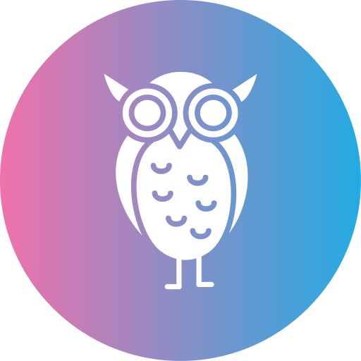

# Peaceful Owl - Language Learning App

## Overview

Peaceful Owl is an interactive language learning application designed to help users learn English vocabulary through various engaging features. The app offers a clean, user-friendly interface with both light and dark themes for comfortable usage at any time of day.

## Features

### Core Functionality
- **Word of the Day**: Daily vocabulary updates with pronunciation and translations
- **Word Cards**: Interactive flashcards with English words, transcriptions, and Russian translations
- **Training Mode**: Practice mode for learning and memorizing words
- **Statistics**: Track your learning progress and success rate

### Technical Features
- **Responsive Design**: Fully adaptive layout for all devices
- **Theme Switching**: Toggle between light and dark modes
- **Local Storage**: Saves user preferences and progress
- **Offline Support**: Core functionality works without internet connection

## Technology Stack

- **Frontend Framework**: React
- **State Management**: MobX
- **Styling**: Styled Components, Material-UI
- **Additional Libraries**:
  - React Router for navigation
  - React Helmet for document head management
  - FontAwesome for icons
  - UUID for unique identifiers

## Getting Started

1. Clone the repository:
`git clone https://github.com/Emmnia/words-app.git`

2. Install dependencies:
`npm install`

3. Run the development server:
`npm run dev`

4. Open `http://localhost:5173` in your browser
